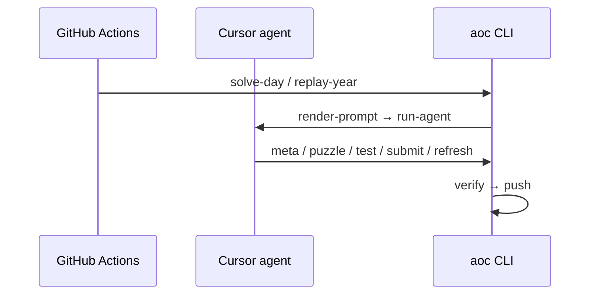

# aoc-bot

Automated [Advent of Code](https://adventofcode.com/) solver. A **Cursor agent** runs autonomously in GitHub Actions, uses the `aoc` CLI to fetch puzzles, test, and submit, then CI verifies and commits solutions.

## How it works



The agent owns the solve loop. CI runs `aoc verify` after the agent to confirm solutions pass local tests.

## CLI

Install with `uv sync`, then:

```bash
uv run aoc --help
```

### Agent toolkit (used by the Cursor agent)

| Command | Purpose |
|---------|---------|
| `prepare` | Fetch input + puzzle text from AoC |
| `puzzle 1\|2` | Print puzzle description |
| `test 1\|2` | Run solution against `.aoc/input.txt` |
| `submit 1\|2` | Submit to adventofcode.com (uses `AOC_SESSION` env) |
| `refresh` | Re-fetch page after Part 1 unlocks Part 2 |
| `meta` | Show day/year/status |

### CI workflows

| Command | Purpose |
|---------|---------|
| `solve-day` | prepare → render-prompt → run-agent → verify → push |
| `replay-year` | Run `solve-day` for a range of days sequentially |
| `verify` | Post-agent sanity check |
| `push` | Commit and push `solutions/YEAR/DAY/` |

## Setup

### Secrets

| Secret | Description |
|--------|-------------|
| `AOC_SESSION` | AoC `session` cookie |
| `CURSOR_API_KEY` | [Cursor Dashboard → API Keys](https://cursor.com/dashboard) |

### Environment variables

| Variable | Default | Description |
|----------|---------|-------------|
| `AOC_YEAR` | current year | Event year |
| `AOC_DAY` | today (December) | Puzzle day |
| `AOC_DRY_RUN` | — | Part 1 only, no submit |
| `AOC_SKIP_COMMIT` | — | Skip `push` in `solve-day` / `replay-year` |
| `CURSOR_MODEL` | `composer-2.5` | Model for `run-agent` |

### Workflows

- **[solve.yml](.github/workflows/solve.yml)** — Dec 1–25 at 05:00 UTC + manual dispatch
- **[test-replay.yml](.github/workflows/test-replay.yml)** — single-day replay test
- **[replay-year.yml](.github/workflows/replay-year.yml)** — full year replay

## Local usage

```bash
uv sync
export AOC_SESSION="..."
export AOC_YEAR=2025 AOC_DAY=1

uv run aoc prepare
uv run aoc puzzle 1

# Full autonomous pipeline
export CURSOR_API_KEY="..."
uv run aoc solve-day --skip-commit
```

## Solution layout

```
solutions/
  2025/
    1/
      part1.py   # def solve(data: str) -> str
      part2.py
```

## Security

- `AOC_SESSION` is only in CI env — the agent must use `aoc submit`, not curl.
- `.cursor/cli.json` allows `uv`/`aoc`/`sleep`; denies `git`, `curl`, `.env` access.
