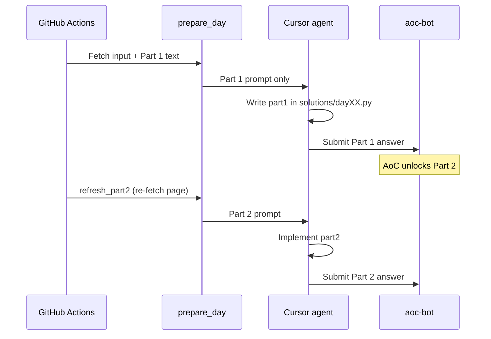

# aoc-bot

Automated [Advent of Code](https://adventofcode.com/) solver that runs on a schedule in GitHub Actions. A **Cursor agent** writes the solution; Python handles fetching the puzzle, verifying, and submitting answers.

## How it works



AoC only reveals Part 2 after Part 1 is accepted. The bot never tries to solve Part 2 before submitting Part 1.

Each part runs in a **retry loop** (default 3 attempts): if verification fails or AoC rejects the answer, the agent gets feedback and tries again.

Puzzles unlock at **midnight US Eastern** (05:00 UTC in December). The workflow polls for up to 2 minutes if the input is not ready yet.

## Setup

### 1. Create a GitHub repo and push this project

### 2. Add repository secrets

| Secret | Description |
|--------|-------------|
| `AOC_SESSION` | Your AoC `session` cookie ([how to get it](https://adventofcode.com/)) |
| `CURSOR_API_KEY` | From [Cursor Dashboard → API Keys](https://cursor.com/dashboard) (uses your plan) |

### 3. Optional repository variables

| Variable | Default | Description |
|----------|---------|-------------|
| `AOC_YEAR` | `2026` | Event year for the scheduled December run |

For **2025 replay testing**, use the [Test Replay workflow](.github/workflows/test-replay.yml) or pass `year: 2025` manually on *AoC Daily Solve*.

| `CURSOR_MODEL` | `composer-2.5` | Model for `agent` in CI |
| `AOC_MAX_ATTEMPTS` | `3` | Agent retries per part on verify/submit failure |

### 4. Enable the workflow

The workflow in [`.github/workflows/solve.yml`](.github/workflows/solve.yml) runs:

- **On schedule**: Dec 1–12 at 05:00 UTC (midnight EST)
- **Manually**: Actions → *AoC Daily Solve* → *Run workflow*

Manual inputs:

- `day` — override the day number (for testing past puzzles)
- `dry_run` — solve Part 1 only (Part 2 requires submission to unlock on AoC)
- `skip_commit` — do not push the solution back to the repo

### 5. Test with 2025 before going live

1. Push the repo and add secrets (`AOC_SESSION`, `CURSOR_API_KEY`).
2. Go to **Actions → Test Replay (2025) → Run workflow**.
3. Defaults: year `2025`, day `1`, dry run **on** (Part 1 only — no submission).
4. Check artifacts for `solutions/day01.py` with a working `part1`.
5. For the **full two-part flow**, re-run with **submit** checked (submits Part 1 → unlocks Part 2 → solves and submits Part 2).

Local replay:

```bash
export AOC_SESSION="..."
# optional local test with cursor-agent login (no key needed on your machine)
AOC_YEAR=2025 AOC_DAY=1 ./scripts/test_replay.sh
```

Once 2025 replay tests pass, set repository variable `AOC_YEAR` to `2026` for the December schedule.


```bash
# Install
uv sync

# Export secrets
export AOC_SESSION="..."
export CURSOR_API_KEY="..."   # only if running agent locally without login

# Fetch today's puzzle artifacts
uv run python scripts/prepare_day.py

# Solve with Cursor agent locally (after `cursor-agent login`)
agent -p "$(cat .aoc/codex-prompt.md)" --force --model composer-2.5

# Or solve a specific day with the built-in LLM solver (no Codex)
AOC_DAY=1 AOC_SOLVER=llm uv run aoc-bot

# Verify without submitting
uv run python scripts/verify_solution.py

# Submit a committed local solution
AOC_DAY=1 AOC_SOLVER=local uv run aoc-bot
```

## Solution format

Each day is a file `solutions/day01.py` … `solutions/day12.py`:

```python
def part1(data: str) -> str:
    return str(...)

def part2(data: str) -> str:
    return str(...)
```

See [`solutions/_template.py`](solutions/_template.py).

## Rate limits

Advent of Code allows about **one submission per minute**. The bot waits 60 seconds between part 1 and part 2 submissions. Respect AoC's [automation guidelines](https://www.reddit.com/r/adventofcode/wiki/index/) — do not hammer their servers.

## Security

- Never commit `AOC_SESSION` or API keys.
- The workflow uses Cursor CLI with `CURSOR_API_KEY` and project permissions in `.cursor/cli.json`.

## Project layout

```
.github/
  workflows/solve.yml          # Scheduled + manual CI
  codex/prompts/solve.md.template
scripts/
  prepare_day.py               # Fetch puzzle → .aoc/
  render_prompt.py             # Build Codex prompt
  verify_solution.py           # Test solution locally
src/aoc_bot/
  client.py                    # AoC HTTP client
  runner.py                    # CLI entrypoint
  solver/                      # Local + optional LLM solvers
solutions/                     # Generated by Codex each day
```
