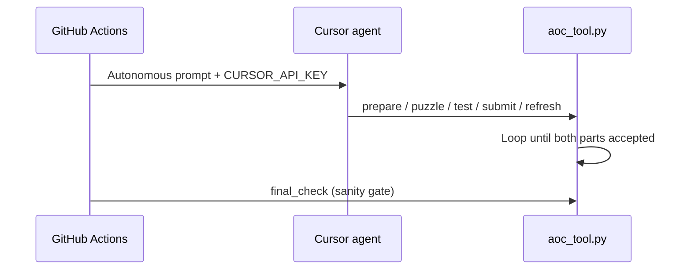

# aoc-bot

Automated [Advent of Code](https://adventofcode.com/) solver. A **Cursor agent** runs autonomously in GitHub Actions with shell tools to fetch puzzles, write code, test, submit, and retry until correct.

## How it works



The agent owns the full loop — CI does not micromanage each step. A lightweight `final_check` runs after the agent to confirm solutions pass local tests.

### Agent toolkit (`scripts/aoc_tool.py`)

| Command | Purpose |
|---------|---------|
| `prepare` | Fetch input + puzzle text from AoC |
| `puzzle 1\|2` | Print puzzle description |
| `test 1\|2` | Run solution against `.aoc/input.txt` |
| `submit 1\|2` | Submit to adventofcode.com (uses `AOC_SESSION` env) |
| `refresh` | Re-fetch page after Part 1 unlocks Part 2 |
| `meta` | Show day/year/status |

Part 2 text only appears after Part 1 is accepted — the agent must `submit 1` → `refresh` → `puzzle 2`.

## Setup

### Secrets

| Secret | Description |
|--------|-------------|
| `AOC_SESSION` | AoC `session` cookie |
| `CURSOR_API_KEY` | [Cursor Dashboard → API Keys](https://cursor.com/dashboard) |

### Optional variables

| Variable | Default | Description |
|----------|---------|-------------|
| `AOC_YEAR` | `2026` | Event year (December cron) |
| `CURSOR_MODEL` | `composer-2.5` | Model for `agent` in CI |

### Workflows

- **[solve.yml](.github/workflows/solve.yml)** — Dec 1–12 at 05:00 UTC + manual dispatch
- **[test-replay.yml](.github/workflows/test-replay.yml)** — replay 2025 puzzles (`dry_run` = Part 1 only, no submit)

## Local usage

```bash
uv sync
export AOC_SESSION="..."
export AOC_YEAR=2025 AOC_DAY=1

# Try the toolkit yourself
uv run python scripts/aoc_tool.py prepare
uv run python scripts/aoc_tool.py puzzle 1

# Run the autonomous agent locally
uv run python scripts/render_prompt.py
agent -p "$(cat .aoc/prompt.md)" --force --model composer-2.5
```

## Solution layout

```
solutions/
  2025/
    1/
      part1.py   # def solve(data: str) -> str
      part2.py
```

See `solutions/_template/` for examples.

## Security

- `AOC_SESSION` is only in CI env — agent must use `aoc_tool.py submit`, not curl.
- `.cursor/cli.json` allows `uv`/`python`/`sleep`; denies `git`, `curl`, `.env` access.
