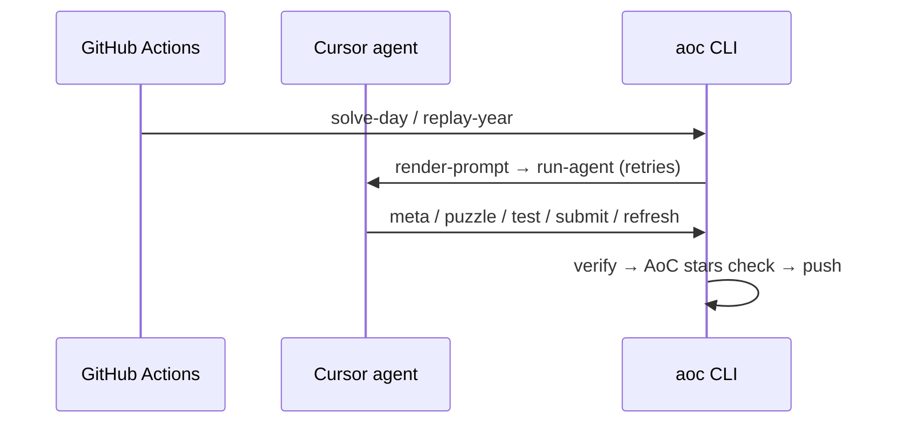

# aoc-bot

Autonomous [Advent of Code](https://adventofcode.com/) solver. A **Cursor agent** runs in GitHub Actions, uses the `aoc` CLI to fetch puzzles, test, and submit, then CI verifies and commits solutions.

Requires **Python ≥ 3.12**. Install dependencies with [uv](https://docs.astral.sh/uv/).

## How it works



The agent owns the solve loop. After each attempt, `aoc verify` runs local tests. Unless `AOC_DRY_RUN` is set, the pipeline also checks that adventofcode.com shows both parts complete, retrying up to `AOC_SOLVE_ATTEMPTS` times (default 3) before failing.

## CLI

```bash
uv sync
uv run aoc --help
```

### Agent toolkit (used by the Cursor agent)

| Command | Purpose |
|---------|---------|
| `prepare` | Fetch input + puzzle text from AoC |
| `puzzle 1\|2` | Print puzzle description |
| `test 1\|2` | Run solution against `.aoc/input.txt` |
| `submit 1\|2` | Submit to adventofcode.com (uses `AOC_SESSION` env) |
| `refresh` | Re-fetch page after Part 1 unlocks Part 2 |
| `meta` | Show day/year/status from `.aoc/meta.json` |
| `input-path` | Print path to `.aoc/input.txt` |
| `assert-day` | Exit 1 if `.aoc/meta.json` ≠ `AOC_YEAR`/`AOC_DAY` |
| `check-day` | Exit 0 if the day is already solved (`--files-only` skips AoC fetch) |

### Pipeline commands

| Command | Purpose |
|---------|---------|
| `render-prompt` | Write the agent prompt to `.aoc/prompt.md` |
| `run-agent` | Run the Cursor agent against the prompt |
| `verify` | Post-agent check (`assert-day` + `test`) |
| `push` | Commit and push `solutions/YEAR/DAY/` |
| `solve-day` | Full pipeline (see below) |
| `replay-year` | Run the solve pipeline for a day range sequentially |

`solve-day` runs: **prepare → render-prompt → run-agent → verify → (AoC stars check) → push**, with retries when verify fails or stars are missing. Days past the event finale (day 12 for 2025+, day 25 before) exit successfully without work.

`replay-year` skips days that are already fully solved (local tests + AoC stars), runs `git pull --rebase` before each day when committing, and caps the end day to the event finale.

## Setup

### Secrets

| Secret | Description |
|--------|-------------|
| `AOC_SESSION` | AoC `session` cookie |
| `CURSOR_API_KEY` | [Cursor Dashboard → API Keys](https://cursor.com/dashboard) |

### Repository variables (optional)

Set under **Settings → Secrets and variables → Actions → Variables**:

| Variable | Default | Description |
|----------|---------|-------------|
| `AOC_YEAR` | `2026` in CI | Event year for scheduled solves |
| `CURSOR_MODEL` | `composer-2.5` | Model for `run-agent` |

### Environment variables

| Variable | Default | Description |
|----------|---------|-------------|
| `AOC_YEAR` | current year | Event year |
| `AOC_DAY` | today in US Eastern (December only) | Puzzle day |
| `AOC_DRY_RUN` | — | Part 1 only: skip submit and only verify part 1 |
| `AOC_SKIP_COMMIT` | — | Skip `push` in `solve-day` / `replay-year` |
| `AOC_SOLVE_ATTEMPTS` | `3` | Max agent retries per day |
| `AOC_START_DAY` | `1` | First day for `replay-year` |
| `AOC_END_DAY` | event finale day | Last day for `replay-year` |
| `CURSOR_MODEL` | `composer-2.5` | Model for `run-agent` |
| `AGENT_TIMEOUT_SECONDS` | `1800` | Cursor agent timeout |

### Event length

| Years | Last puzzle day |
|-------|-----------------|
| 2025 and later | 12 (finale star, no real Part 2 puzzle) |
| 2024 and earlier | 25 |

Scheduled runs after the finale day exit cleanly (no failed workflow).

### Workflows

- **[solve.yml](.github/workflows/solve.yml)** — Dec 1–25 at 05:00 UTC (midnight US Eastern) + manual dispatch. Uses `vars.AOC_YEAR` when set.
- **[test-replay.yml](.github/workflows/test-replay.yml)** — single-day replay test (`dry_run` defaults to true, never commits)
- **[replay-year.yml](.github/workflows/replay-year.yml)** — full year replay (default year 2021, days 1–25)

## Local usage

```bash
uv sync
export AOC_SESSION="..."
export AOC_YEAR=2025 AOC_DAY=1

uv run aoc prepare
uv run aoc puzzle 1

# Full autonomous pipeline (requires Cursor CLI: curl https://cursor.com/install | bash)
export CURSOR_API_KEY="..."
uv run aoc solve-day --skip-commit
```

## Solution layout

```
solutions/
  2025/
    1/
      part1.py   # def solve(data: str) -> str
      part2.py
```

## Security

- `AOC_SESSION` is only in CI env — the agent must use `aoc submit`, not curl.
- `.cursor/cli.json` allows `uv`/`aoc`/`python`/`sleep`; denies `git`, `curl`, `.env` access.
